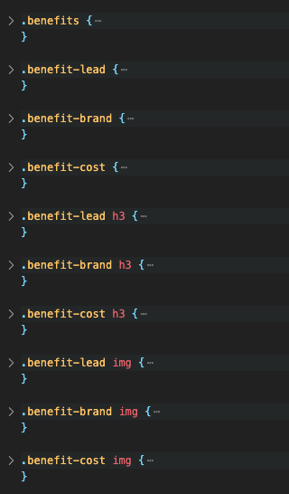

# marketing-agency-refractor-project

refract a marketing agency website to use semantic HTML

## Table of contents

- [Overview](#overview)
  - [The challenge](#the-challenge)
  - [Screenshot](#screenshot)
  - [Links](#links)
- [My process](#my-process)
- [Technologies](#technologies)

## Overview

This task is an on-the-job ticket—meaning that you'll begin with starter code that you need to modify.

Refactoring existing code (improving it without changing what it does) to meet a certain set of standards or to implement a new technology is a common task for front-end and junior developers. For this particular assignment, a marketing agency has hired me to refactor an existing site to make it more accessible.

### the challenge

multiple tasks are required in this challenge, which are:

- Make it accessible
- Possibly refactor CSS code
- Use semantic HTML elements where possible
- Include comments
- Make sure the page has a logical structure (title, header, body, footer)
- There should be a logical order to headings (h1->h6)
- Ensure there are alt attributes for all images and keep it descriptive
- Document title (head element) should be descriptive
- Search Engine Optimisation nav link is broken (fix it)
- Remove duplicate class names in CSS and replace with generic class name in HTML

### Screenshot

The following image shows the web application's appearance and functionality:

there was not changes to the underlying code so the before and after screenshots of the web page are the same. however, below will be screenshots of the CSS HTML, before and after refactoring.

#### BEFORE SCREENSHOTS

#### AFTER SCREEN

### Links

- Github URL: [https://github.com/awarsame1996/marketing-agency-refractor-project](https://github.com/awarsame1996/marketing-agency-refractor-project)

## My process

first, all images were missing alt tags. so i added descriptive alt tags
